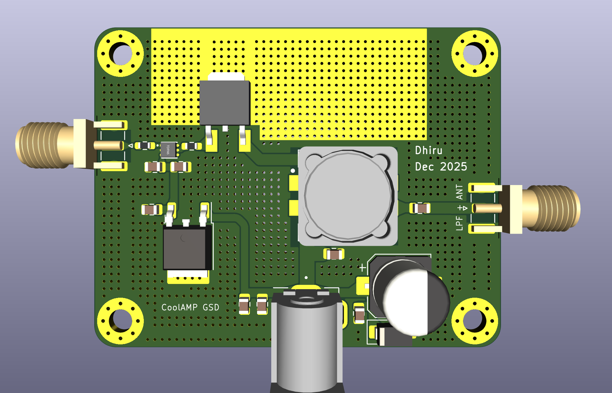

This version uses a GaN gate driver (MX1025D) and GSD pinout TO-252 package GaN FET. It also uses a cost-effective Chinese `coupled inductor`.

Works without extra cooling at 12V to 15V drain. 20V drain needs extra cooling for heavy duty cycles. 

For WSPR, I recommend running at 7.5V drain with ~1W output.

This is the same as `GSD-Hacks-v7` but with an 10 ohms series resistor added to the TTL input port.
