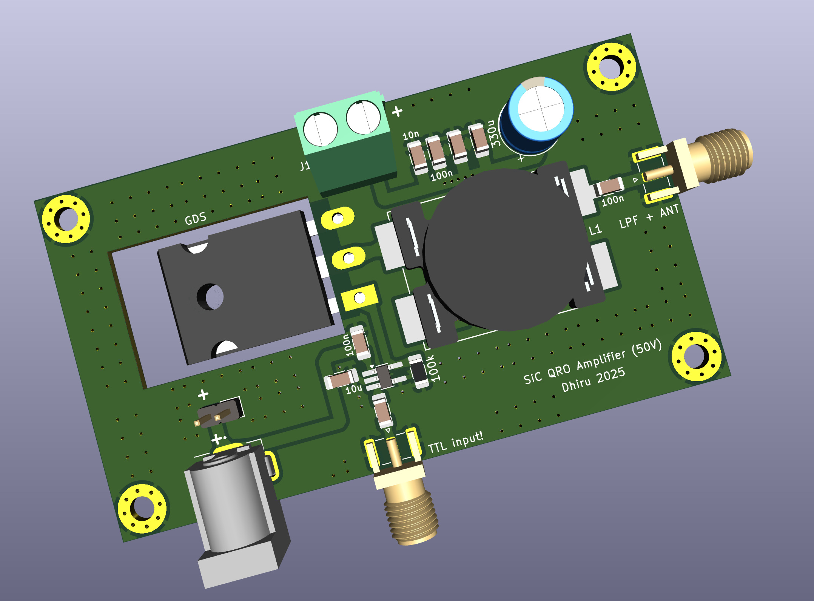

NB: This design is inspired by the wonderful `Single NXP MRF-101 Eval Board`
project by Jim Veatch.

https://sites.google.com/site/rfpowertools/rf-power-tools

Backstory: Sometimes we all need a bit of "QRO" in life...

So we give you the `Baby QRO` switching amplifier!

MRF101 is too "precious" for WSPR usage, especially with its self-limiting
TO-220 package.

This PCB was tested in late January-2025 and it works great. Produces 100W+ at
50V drain on 7 MHz. The gain drops with increasing frequency but not too badly!

Results:

[Conservative] 9V driver, 43V drain -> ~70W @ 7 MHz, 60W @ 14 MHz, 30W @ 28 MHz

12V driver, 43V drain -> 50W @ 28 MHz, ~70W @ 7 MHz. Efficiency is close to 50
percent on 28 MHz it seems. 55% efficiency at 7 MHz.

[TOP] 12V driver, 48V drain -> 60W @ 28 MHz, 100W @ 7 MHz.

Cost for 100W: Around 15 dollars (for all including PCB and BOM components)

